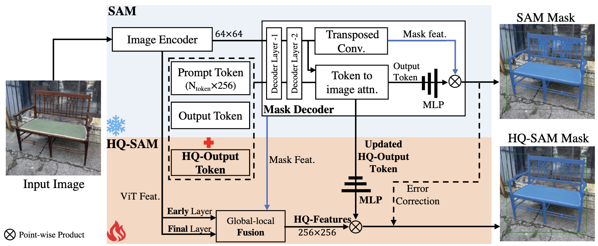
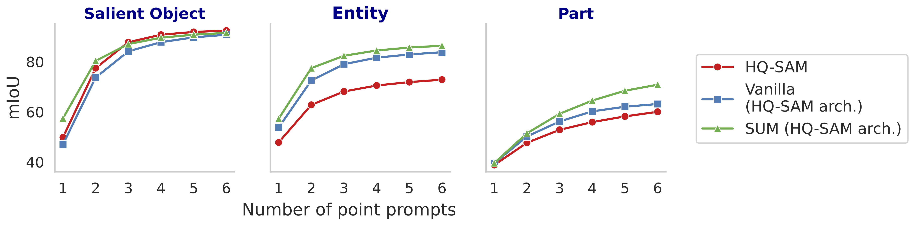

# SUM implemented with the HQ-SAM architecture

This implementation builds on the HQ-SAM (Segment Anything in High Quality) architecture by incorporating the SUM method. We largely follow the HQ-SAM training approach, with the key difference being the addition of the sam1b dataset and the use of an uncertainty-aware training method.

To ensure a fair comparison, we followed the HQ-SAM implementation and did not use the interactive training method for point sampling, unlike the main experiments.

For more details, refer to our [paper](https://openreview.net/pdf?id=qNXRXUC90b).





Quantitative comparison between HQ-SAM and SUM (HQ-SAM architecture)
-----------------

### Comparison of HQ-SAM with Vanilla and SUM fine-tuned Using the Same Lightweight Scheme as HQ-SAM
SUM Matches HQ-SAM and outperforms Vanilla in salient-object segmentation and is superior in entity and part segmentation.




### **Installation**
The code requires `python>=3.8`, as well as `pytorch>=1.7` and `torchvision>=0.8`. Please follow the instructions [here](https://pytorch.org/get-started/locally/) to install both PyTorch and TorchVision dependencies. Installing both PyTorch and TorchVision with CUDA support is strongly recommended.

Go to the repository locally and install with

```
pip install -e .
```

The following optional dependencies are necessary for mask post-processing, saving masks in COCO format, the example notebooks, and exporting the model in ONNX format. `jupyter` is also required to run the example notebooks.

```
pip install opencv-python pycocotools matplotlib onnxruntime onnx
```

### Example conda environment setup
```bash
conda create --name sam_hq python=3.8 -y
conda activate sam_hq
conda install pytorch==1.10.0 torchvision==0.11.0 cudatoolkit=11.1 -c pytorch -c nvidia
pip install opencv-python pycocotools matplotlib onnxruntime onnx

# under your working directory
git clone https://github.com/SysCV/sam-hq.git
cd sam-hq
pip install -e .
export PYTHONPATH=$(pwd)
```

### **Model Checkpoints**

Three HQ-SAM model versions of the model are available with different backbone sizes. These models can be instantiated by running

```
from segment_anything import sam_model_registry
sam = sam_model_registry["<model_type>"](checkpoint="<path/to/checkpoint>")
```

Download the provided trained model below and put them into the pretrained_checkpoint folder:
```
mkdir pretrained_checkpoint
``` 

Click the links below to download the checkpoint (##TODO)

### **Getting Started**

First download a [model checkpoint](#model-checkpoints). Then the model can be used in just a few lines to get masks from a given prompt:

```
from segment_anything import SamPredictor, sam_model_registry
sam = sam_model_registry["<model_type>"](checkpoint="<path/to/checkpoint>")
predictor = SamPredictor(sam)
predictor.set_image(<your_image>)
masks, _, _ = predictor.predict(<input_prompts>)
```

Additionally, see the usage examples in our [demo](/demo/demo_hqsam.py)

To obtain model's visual result:
```
python demo/demo_hqsam.py
```

### **SUM (HQ-SAM architecture) Tuning**
We provide detailed training, evaluation, visualization and data downloading instructions in [SUM (HQ-SAM architecture) training](train/README.md).

Please change the current folder path to:
```
cd train
```
and then refer to detailed [readme instruction](train/README.md).


## Acknowledgments
- Thanks [SAM](https://github.com/facebookresearch/segment-anything) for their public code and released models.
- Thanks [HQ-SAM](https://github.com/SysCV/sam-hq) for their public code and released models, this implementation largely follow the repo